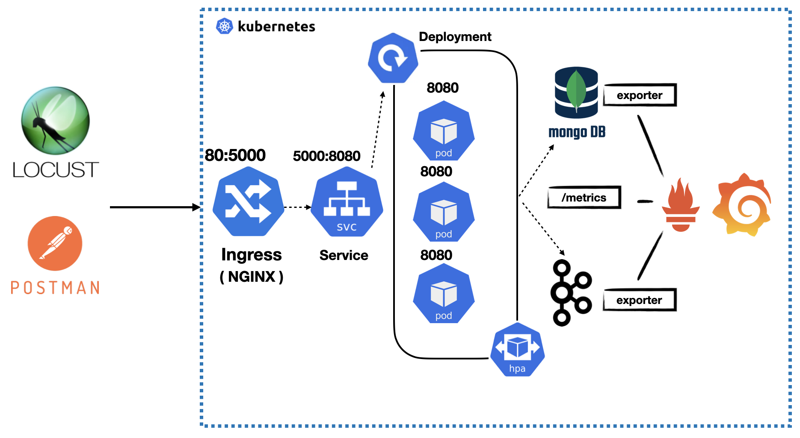

# Distributed Systems & Big Data 2024 

## Andrea Calabretta

# Istruzioni per il deploy su k8s


[Relazione](https://docs.google.com/document/d/1UOKLWHAr4T8uMy0Seu2Pvf9NBwkiemvxVK4VONbAqZc/edit#heading=h.6g7p9ad3858p)



Se precedentemente è stato creato un cluster di nome "my-cluster", eliminiamolo con:
```sh
kind delete cluster --name my-cluster
```
Creaiamo il nuovo cluster secondo quanto presente nel file di configurazione:

```sh
kind create cluster --config=config.yml
```
Configuriamo NGINX come Ingress, seguendo la configurazione della documentazione ufficiale:

```sh
kubectl apply -f https://raw.githubusercontent.com/kubernetes/ingress-nginx/master/deploy/static/provider/kind/deploy.yaml
```
Creiamo 2 namespace che ci serviranno successivamente:

```sh
kubectl create namespace dsbd;
kubectl create namespace monitoring
```
Facciamo l'apply del manifest dell'ingress:
```sh
kubectl apply -f ingress.yml
```
Facciamo l'apply del manifest di kafka:
```sh
kubectl apply -f kafka-exporter.yml -n dsbd
```
Facciamo l'apply del manifest del database mongo:

```sh
kubectl apply -f paymentdb.yml -n dsbd
```
All'interno del pod del database, creiamo l'utente admin che ci serve per essere coerenti con il resto delle configurazioni:

```sh
kubectl exec -it paymentdb-0 -n dsbd -- /bin/bash
mongo
use admin

db.createUser(
  {
    user: "root",
    pwd: "toor",
    roles: [ { role: "root", db: "admin" } ]
  }
)
```

Ora creiamo il pod che gestisce i pagamenti:

```sh
kubectl apply -f micropayment.yml -n dsbd
```
Monitoriamo tutti i pods del namespace dsbd:

```sh
watch kubectl get pods -n dsbd
```

Ora monitoriamo la coda kafka e i topic orders e logging:

Per entrare dentro il pod di kafka appena creato:
```sh
kubectl exec -it kafka-0 -n dsbd -- /bin/bash
```

avviamo il consumer di kafka sul topic orders:
```sh
kafka-console-consumer --bootstrap-server kafka:9092 --topic orders
```
e lasciamo il terminale aperto (qui vedremo gli orders)

a questo punto facciamo una POST all’endpoint:
```sh
http://localhost:80/payment/ipn
```

con il comando CURL:
```sh
curl -X POST http://localhost:80/payment/ipn \
-H "Content-Type: application/json" \
-d '{
    "orderId": "0020",
    "userId": 9,
    "amountPaid": 4500
}'

```

Apriamo un altro terminale e avviamo il consumer di kafka sul topic logging:
```sh
kafka-console-consumer --bootstrap-server kafka:9092 --topic logging
```
e lasciamo il terminale aperto (qui vedremo i logging in caso di errore)

generiamo un errore con il comando CURL, facendo una chiamata ad un endpoint inesistente :
```sh
curl -X POST http://localhost:80/payment/ipnn \
-H "Content-Type: application/json" \
-d '{
    "orderId": "0020",
    "userId": 9,
    "amountPaid": 4500
}'

```

## Configurazione dei METRICS SERVER 

Configuriamo i metrics server che ci servono per monitorare i parametri del nostro cluster (CPU e Memoria) e poter gestire l'autoscaling di conseguenza:

```sh
cd load; 
kubectl apply -f metrics-server.yml
```
Aspettiamo che il pod dei metrics-server sia attivo perchè altrimenti non possiamo avviare l'Horizzontal Pod Autoscaling

```sh
watch "kubectl get pods -n kube-system | tail -n 2"
watch -n 1 "kubectl get pods -n kube-system | tail -n 5"
```
Appena i metrics-server sono attivi, l'HPA sarà in grado di ricevere le metriche di CPU e quindi dimensionare i pod di conseguenza.

## LOCUST e Horizontal Pod Autoscaling (HPA)
```sh
cd load
kubectl apply -f micropayment-hpa.yml -n dsbd
watch kubectl get hpa -n dsbd
```

A questo punto possiamo stressare il nostro cluster con Locust:
```sh
locust -f locust.py --host http://localhost:80
```

e accediamo alla GUI di Locust andando su:
```sh
localhost:8089
```

## PROMETHEUS E GRAFANA 
A questo punto configuriamo Prometheus e Grafana:

```sh
helm install prometheus prometheus-community/kube-prometheus-stack --namespace=monitoring
```
```sh
helm repo update
```
```sh
helm repo add Prometheus-community https://prometheus-community.github.io/helm-charts
```
```sh
helm upgrade prometheus prometheus-community/kube-prometheus-stack --reset-values --namespace=monitoring
```


watch kubectl --namespace monitoring get pods -l "release=prometheus"
watch kubectl --namespace default get pods -l "release=prometheus"


## Mongo DB EXPORTER
Installiamo l'exporter di mongo nel namespace monitoring
```sh
helm install mongodb-exporter prometheus-community/prometheus-mongodb-exporter -f values-mongodb-exporter.yml -n monitoring
```


Altri comandi che possono tornarci utili all'occorrenza:
```sh
kubectl get svc -n monitoring 
kubectl get pod -n monitoring
kubectl get servicemonitor -n monitoring
kubectl get servicemonitor mongodb-exporter-prometheus-mongodb-exporter -o yaml -n monitoring

kubectl get svc -n monitoring
kubectl port-forward service/mongodb-exporter-prometheus-mongodb-exporter 9216 -n monitoring
```

## KAFKA EXPORTER

```sh
helm install kafka-exporter prometheus-community/prometheus-kafka-exporter -f values-kafka-exporter.yml -n dsbd
```

Altri comandi che possono tornarci utili:
```sh
helm uninstall kafka-exporter -n dsbd

kubectl get svc -n dsbd 

kubectl logs kafka-0 -n dsbd -c kafka
kubectl logs kafka-0 -n dsbd -c kafka-exporter
kubectl get pod -n monitoring
helm uninstall mongodb-exporter -n monitoring
helm uninstall kafka-exporter -n dsbd
```

## PROMETHEUS
Questo è il tutorial che ho seguito:

https://www.youtube.com/watch?v=mLPg49b33sA

Facciamo forwarding della porta per poter accedere alla GUI di Prometheus da browser:
```sh
kubectl port-forward service/prometheus-kube-prometheus-prometheus 9090 -n monitoring
```
Accediamo alla GUI di Prometheus:
```sh
localhost:9090
```

## GRAFANA
Facciamo forwarding della porta per poter accedere alla GUI di Grafana da browser:
```sh
kubectl port-forward deployment/prometheus-grafana 3000 -n monitoring
```

Accediamo alla GUI di Grafana:
```sh
localhost:3000
```

Username:
```sh
admin
```
Password:
```sh
prom-operator
```

(per vedere quali sono tutti gli eventi che si sono verificati nel cluster, utile per capire perchè lo scheduler è andato giù)
```sh
kubectl get events
```

