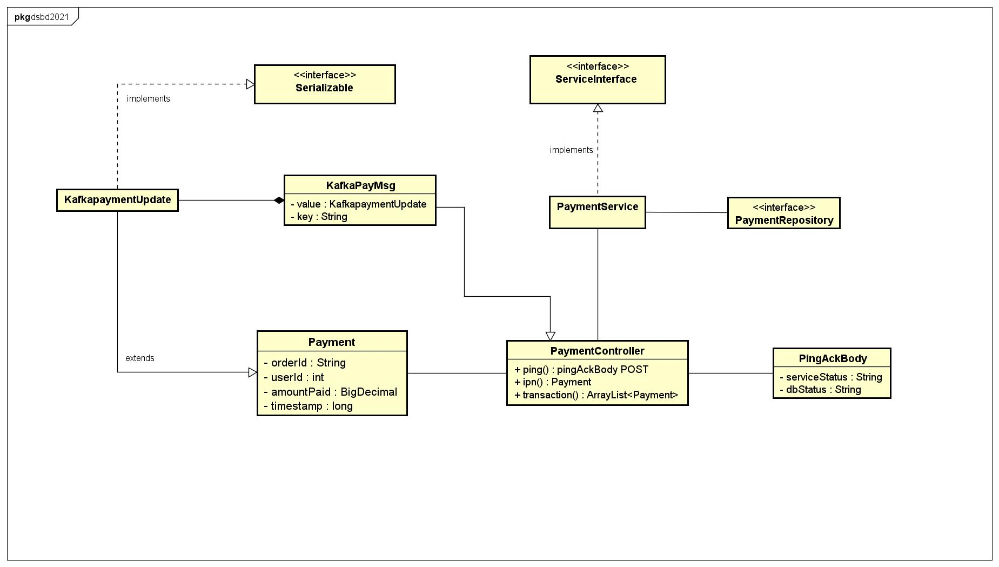
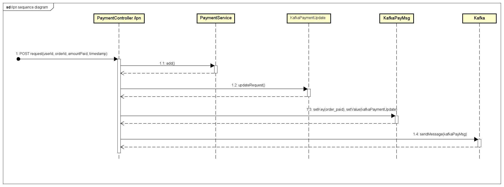
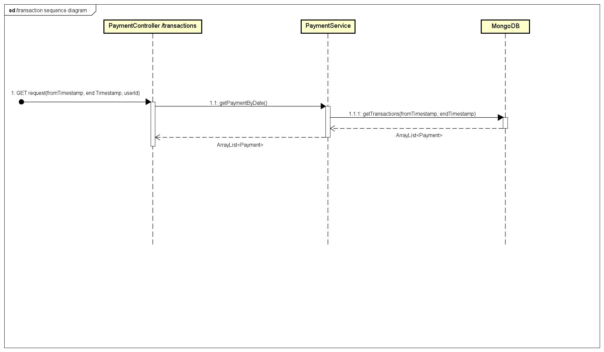
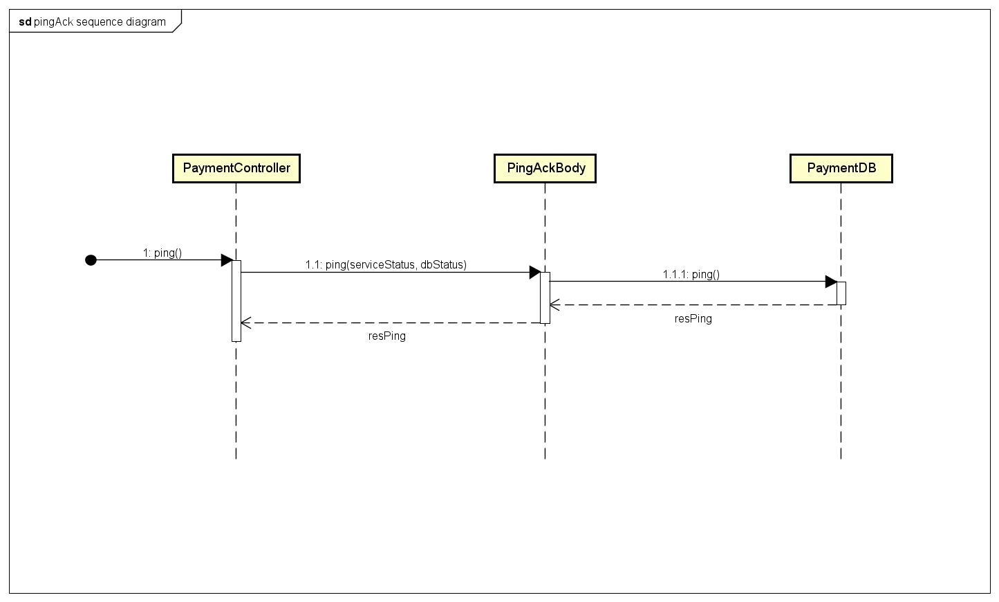

# Distributed Systems & Big Data 2020/2021 - Progetto 3B - Calabretta-Mauro 

## Relazione finale

### 1. Introduzione
Nella realizzazione di un sistema “e-commerce” distribuito, ci siamo dedicati allo sviluppo del micro-servizio relativo alla gestione dei pagamenti (Progetto 3) nella sua variante B. 
Come da specifiche di progetto, le tecnologie utilizzate sono : 
- **Database non relazionale -MongoDB-** 
- **Java Spring MVC**
- **Spring Data MongoDB**

Tramite Docker, vengono generati 4 container rispettivamente per la gestione di mongodb, del micro-servizio payment-manager, del broker kafka e di zookeeper.

Per avviare il progetto è verificarne le principali funzionalità è consigliabile visionare questo breve video di 4 minuti:   https://youtu.be/Uls36uPjKD8

### 2. Diagramma delle classi

Ecco il diagramma delle classi principali:




### 3. Controller - Entrypoints

Come da specifiche di progetto, è stata realizzata una classe PaymentController con l'annotation @Controller che espone i due entrypoint:

- POST /payment/ipn
- GET /payment/transactions

Il primo è utilizzato per simulare l'invio di un pagamento, ovvero una API POST contenente i parametri userId, orderId, amountPaid e timestamp relativi all'ordine.
Il risultato dell'operazione è che un json di questo tipo, viene sia salvato sul database Mongo e che memorizzato nella coda Kafka sul topic orders (nel formato descritto dalle specifiche)

``` JSON
 {
     "orderId": "0015",
     "userId": 2,
     "amountPaid": 2000,
     "timestamp": 1611858477
 }
```

Ecco il diagramma di sequenza che descrive il funzionamento dell'entrypoint /payment/ipn  :



Invece, l'entrypoint /transactions?fromTimestamp=timestamp1&Timestamp=timestamp2 restituisce le transazioni effettuate o all'interno di un dato intervallo di tempo i cui estremi sono fromTimestamp ed endTimestamp, solamente se l'header della richiesta ha "userId" = 0.

``` JSON
{
   {
     "orderId": "0013",
     "userId": 2,
     "amountPaid": 2500,
     "timestamp": 1611856883
   },
   {
     "orderId": "0014",
     "userId": 4,
     "amountPaid": 1000,
     "timestamp": 1611857573
    },
    {
     "orderId": "0015",
     "userId": 1,
     "amountPaid": 750,
     "timestamp": 1611858477
    }
}
```

Ecco il diagramma di sequenza relativo all'entrypoint /payment/transaction?fromTimestamp=timestamp1&Timestamp=timestamp2   :




### 4. Controller - Error handling

All'interno del controller è stato inoltre implementato il meccanismo per la gestione degli errori.
Come da specifiche, al fallimento della richiesta HTTP, il micro-servizio deve pubblicare il messaggio all'interno del topic "logging" di Kafka; questo è stato realizzato

### 5. Kafka e Ping Ack

La strategia di Health-Check utilizzata è Ping Ack.
Ecco il diagramma di sequenza che ne descrive il funzionamento:


